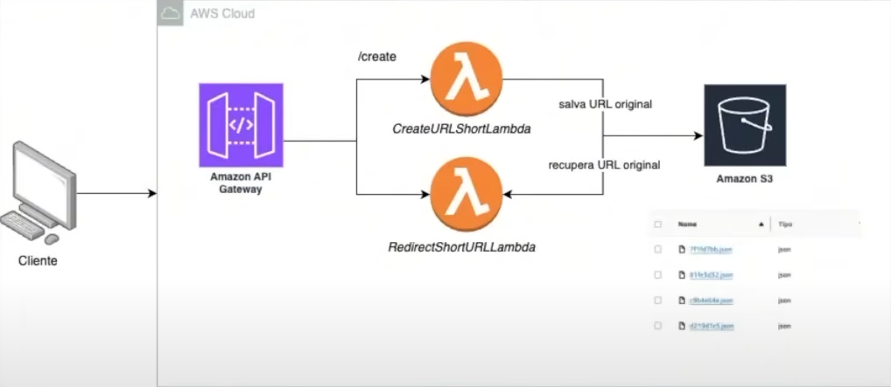

# 🚀 Sistema de Encurtamento de URLs na AWS

Neste repositório, vamos explorar o poder das funções serverless usando AWS Lambda, Amazon S3, e muito mais, para criar um serviço de **encurtamento de URLs** dinâmico, seguro e escalável.



## 💻 O Que Vamos Aprender?

1. **Configuração da AWS**: Criando uma conta e configurando as ferramentas necessárias.
2. **Funções Serverless**: Desenvolvendo funções Lambda para criar URLs encurtadas.
3. **Armazenamento Escalável**: Usando o Amazon S3 para armazenar os dados das URLs.
4. **Redirecionamento e Expiração de Links**: Implementando a lógica para redirecionamento de URLs e verificações de expiração.
5. **API Gateway**: Centralizando e gerenciando todas as requisições do sistema.

Ao final, você terá um sistema funcional para encurtamento de URLs, com armazenamento em S3 e redirecionamento inteligente.

---

## 🛠️ Tecnologias Usadas

- **AWS Lambda**: Para funções serverless e escaláveis.
- **Amazon S3**: Para armazenar informações sobre as URLs.
- **API Gateway**: Para centralizar e gerenciar todas as requisições.
- **UUID**: Para gerar códigos únicos para cada URL encurtada.

---

## ⚙️ Como Funciona?

A principal função do nosso serviço é criar URLs encurtadas e armazená-las de maneira segura no Amazon S3. Ao criar uma URL encurtada, geramos um código único com **UUID** e configuramos um tempo de expiração para que o link seja válido apenas por um determinado período.

O processo acontece da seguinte maneira:

1. **Criação da URL Curta**:
   - Recebemos a URL original e o tempo de expiração via requisição.
   - Geramos um código curto único (8 caracteres).
   - Armazenamos a URL e os dados no Amazon S3.
   
2. **Redirecionamento**:
   - Quando o usuário acessa a URL curta, o sistema verifica se ela é válida (com base na data de expiração) e faz o redirecionamento para a URL original.

---

## 🏗️ Estrutura do Projeto

Abaixo está a função principal do sistema, que é responsável por gerar e armazenar as URLs encurtadas:

```java
package com.rocketseat.createUrlShortener;

import java.util.HashMap;
import java.util.Map;
import java.util.UUID;

import com.amazonaws.services.lambda.runtime.Context;
import com.amazonaws.services.lambda.runtime.RequestHandler;
import com.fasterxml.jackson.databind.ObjectMapper;
import software.amazon.awssdk.core.sync.RequestBody;
import software.amazon.awssdk.services.s3.S3Client;
import software.amazon.awssdk.services.s3.model.PutObjectRequest;

public class Main implements RequestHandler<Map<String, Object>, Map<String, String>> {

    private final com.fasterxml.jackson.databind.ObjectMapper objectMapper = new ObjectMapper();
    private final S3Client s3Client =  S3Client.builder().build();

    @Override
    public Map<String, String> handleRequest(Map<String, Object> input, Context context) {
        String body = input.get("body").toString();

        Map<String, String> bodyMap;
        try {
            bodyMap = objectMapper.readValue(body, Map.class);
        } catch (Exception exception) {
            throw new RuntimeException("Error parsing JSON body: " + exception.getMessage(), exception);
        }

        String originalUrl = bodyMap.get("originalUrl");
        String expirationTime = bodyMap.get("expirationTime");
        long expirationTimeInSeconds = Long.parseLong(expirationTime);

        String shortUrlCode = UUID.randomUUID().toString().substring(0, 8);
        UrlData urlData = new UrlData(originalUrl, expirationTimeInSeconds);

        try {
            String urlDataJson = objectMapper.writeValueAsString(urlData);

            PutObjectRequest request = PutObjectRequest.builder()
                    .bucket("balde-url-shortener")
                    .key(shortUrlCode + ".json")
                    .build();

            s3Client.putObject(request, RequestBody.fromString(urlDataJson));
        } catch (Exception exception){
            throw new RuntimeException("Error saving data to S3: " + exception.getMessage(), exception);
        }

        Map<String, String> response = new HashMap<>();
        response.put("code", shortUrlCode);

        return response;
    }
}
```

E para completar a estrutura, temos o modelo de dados para armazenar as URLs:

```java
package com.rocketseat.createUrlShortener;

import lombok.AllArgsConstructor;
import lombok.Getter;
import lombok.Setter;

@AllArgsConstructor
@Setter
@Getter
public class UrlData {
    private String originalUrl;
    private long expirationTime;

    public UrlData(String originalUrl, long expirationTimeInSeconds) {
    }
}
```

---

## 🚀 Como Usar?

### Passo 1: Criar uma Conta na AWS

1. Acesse o [site da AWS](https://aws.amazon.com) e crie uma conta.
2. Configure o **IAM** para gerar suas credenciais.

### Passo 2: Criar a Função Lambda

1. Crie uma função Lambda na AWS.
2. Carregue o código-fonte (como mostrado acima).
3. Adicione as permissões necessárias para o acesso ao S3.

### Passo 3: Configurar o API Gateway

1. Crie um novo **API Gateway**.
2. Crie um endpoint POST para enviar as requisições de criação de URLs curtas.
3. Integre o API Gateway à sua função Lambda.

### Passo 4: Testar

Envie uma requisição com o seguinte formato JSON:

```json
{
  "originalUrl": "https://www.exemplo.com",
  "expirationTime": "3600"
}
```

Você receberá uma resposta como:

```json
{
  "code": "1234abcd"
}
```

E pronto! Sua URL curta foi criada e armazenada no S3.

---

## 🚨 Problemas Comuns

- **Erro ao salvar no S3**: Verifique se a função Lambda tem as permissões corretas para acessar o S3.
- **Formato de dados inválido**: Certifique-se de que os dados enviados na requisição estejam no formato correto.

---

## 🎉 Conclusão

Agora você tem um sistema completo de **encurtamento de URLs serverless**, com integração com o **Amazon S3** para armazenar os dados e **API Gateway** para gerenciar as requisições. 🚀

Se você gostou do projeto, dê uma estrela ⭐️ e compartilhe com seus amigos! E fique à vontade para contribuir ou sugerir melhorias!
